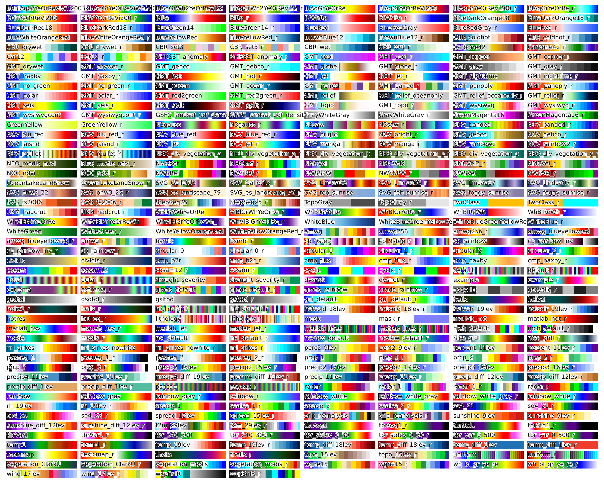

cmaps
=====

Forked from hhuangwx cmaps_ repository

.. _cmaps: https://github.com/hhuangwx/cmaps

Make it easier to use user defined colormaps in matplotlib. Default colormaps are from NCL_ website.

.. _NCL: http://www.ncl.ucar.edu/Document/Graphics/color_table_gallery.shtml

Users can define a environmental variable CMAP_DIR pointing to the folder containing the self-defined rgb files.

Installation::

    pip install git+https://github.com/amizyuk/cmaps

or::
    
    git clone https://github.com/amizyuk/cmaps.git
    pip install cmaps

In case you would like to improve the code::

    ...
    pip install -e cmaps

Usage::

    import matplotlib.pyplot as plt
    import cmaps
    import numpy as np

    x = y = np.arange(-3.0, 3.01, 0.05)
    X, Y = np.meshgrid(x, y)

    sigmax = sigmay = 1.0
    mux = muy = sigmaxy=0.0

    Xmu = X-mux
    Ymu = Y-muy

    rho = sigmaxy/(sigmax*sigmay)
    z = Xmu**2/sigmax**2 + Ymu**2/sigmay**2 - 2*rho*Xmu*Ymu/(sigmax*sigmay)
    denom = 2*np.pi*sigmax*sigmay*np.sqrt(1-rho**2)
    Z = np.exp(-z/(2*(1-rho**2))) / denom

    plt.pcolormesh(X,Y,Z,cmap=cmaps.WhiteBlueGreenYellowRed)
    plt.colorbar()

List the colormaps using the code in the examples::

    import cmaps
    import numpy as np
    import inspect

    import matplotlib.pyplot as plt
    import matplotlib
    from matplotlib import patheffects
    matplotlib.rc('text', usetex=False)

    def list_cmaps():
        attributes = inspect.getmembers(cmaps, lambda _: not (inspect.isroutine(_)))
        colors = [_[0] for _ in attributes if
                  not (_[0].startswith('__') and _[0].endswith('__'))]
        return colors

    if __name__ == '__main__':
        colormaps = list_cmaps()

        gradient = np.linspace(0, 1, 256)
        gradient = np.vstack((gradient, gradient))

        ncols = 8
        nrows = len(colormaps) // ncols + 1
        fig, axs = plt.subplots(figsize=(10, 8),nrows=nrows,ncols=ncols)
        fig.subplots_adjust(top=0.99, bottom=0.01, left=0.01, right=0.99,hspace=0.25,wspace=0.05)
        for (cmap,ax) in zip(colormaps,axs.flat):
            # ax.axis('off')
            ax.imshow(gradient, aspect='auto', cmap=getattr(cmaps, cmap), origin='lower')
            ax.text(.01, 0.5, cmap, va='center', ha='left', fontsize=7,
                    transform=ax.transAxes,
                    path_effects=[patheffects.withStroke(linewidth=1.1,
                                                            foreground="w")])
        for ax in axs.flat:
            ax.axis('off')
        fig.savefig('colormaps.png', dpi=300)

Note that "Slicing" function like list or numpy array is supported for cmaps::

    cmaps.amwg256[20:-20:2]
    cmaps.amwg256[-20:20:-2]

